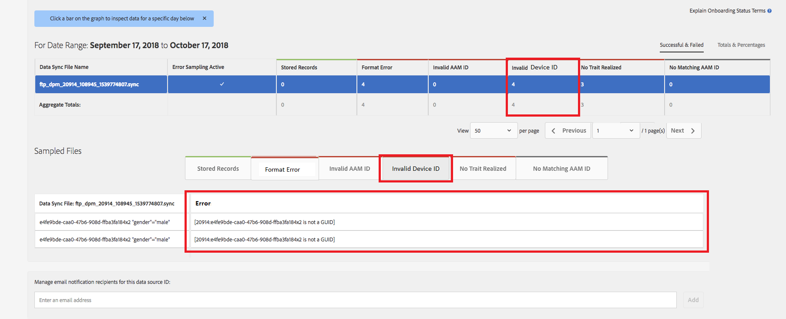

# Algemene validatie van apparaat-id {#global-device-id-validation}

Identificatienummers voor advertenties van apparaten (iDFA, GAID, Roku ID) hebben opmaakstandaarden die moeten worden nageleefd om te kunnen worden gebruikt in het ecosysteem voor digitale reclame. Tegenwoordig kunnen klanten en partners id&#39;s in elke gewenste indeling uploaden naar onze Global [!UICONTROL data sources] zonder op de hoogte te worden gesteld van de juiste indeling van de id. Deze functie introduceert validatie van apparaat-id&#39;s die naar Global [!UICONTROL data sources] worden verzonden voor de juiste opmaak en geeft foutberichten wanneer id&#39;s onjuist zijn opgemaakt. Bij het starten ondersteunen we validatie voor [!DNL iDFA], [!DNL Google Advertising] en [!DNL Roku IDs].

## Overzicht van opmaakstandaarden {#overview-of-format-standards}

Hieronder vindt u de algemene advertenties-id-pools voor apparaten die momenteel worden herkend en ondersteund door AAM. Deze worden geïmplementeerd als gedeelde [!UICONTROL Data Sources] die kan worden gebruikt door elke klant of gegevenspartner die werkt met gegevens die zijn gekoppeld aan gebruikers van deze platforms.

<table>
  <tr>
   <td>Platform </td>
   <td>Gegevensbron-id AAM </td>
   <td>ID-indeling </td>
   <td>AAM PID </td>
   <td>Notities </td>
  </tr>
  <tr>
   <td>Google Android (GAID)</td>
   <td>20914</td>
   <td>32 hexadecimale getallen, gewoonlijk weergegeven als 8-4-4-4-12<em>voorbeeld, 97987bca-ae59-4c7d-94ba-ee4f19ab8c21  </em> </td>
   <td>1352</td>
   <td>Deze id moet worden verzameld in een raw/unhashed/unchanged form Reference - <a href="https://play.google.com/about/monetization-ads/ads/ad-id/">https://play.google.com/about/monetization-ads/ads/ad-id/</a></td>
  </tr>
  <tr>
   <td>Apple iOS (IDFA)</td>
   <td>20915</td>
   <td>32 hexadecimale getallen, gewoonlijk weergegeven als 8-4-4-4-12 <em>voorbeeld, 6D92078A-8246-4BA4-AE5B-76104861E7DC  </em> </td>
   <td>3560</td>
   <td>Deze id moet worden verzameld in een raw/unhashed/unchanged form Reference - <a href="https://support.apple.com/en-us/HT205223">https://support.apple.com/en-us/HT205223</a></td>
  </tr>
  <tr>
   <td>Roku (RIDA)</td>
   <td>121963</td>
   <td>32 hexadecimale getallen, gewoonlijk weergegeven als 8-4-4-4-12 <em>voorbeeld,</em> <em>fcb2a29c-315a-5e6b-bcfd-d889ba19aada</em></td>
   <td>11536</td>
   <td>Deze id moet worden verzameld in een raw/unhashed/unchanged form Reference - <a href="https://sdkdocs.roku.com/display/sdkdoc/Roku+Advertising+Framework">https://sdkdocs.roku.com/display/sdkdoc/Roku+Advertising+Framework</a> </td>
  </tr>
  <tr>
   <td>Microsoft Advertising ID (MAID)</td>
   <td>389146</td>
   <td>Numerieke tekenreeks</td>
   <td>14593</td>
   <td>Deze id moet worden verzameld in een raw/unhashed/unchanged form Reference - <a href="https://docs.microsoft.com/en-us/uwp/api/windows.system.userprofile.advertisingmanager.advertisingid">https://docs.microsoft.com/en-us/uwp/api/windows.system.userprofile.advertisingmanager.advertisingid</a> <a href="https://msdn.microsoft.com/en-us/library/windows/apps/windows.system.userprofile.advertisingmanager.advertisingid.aspx">https://msdn.microsoft.com/en-us/library/windows/apps/windows.system.userprofile.advertisingmanager.advertisingid.aspx</a></td>
  </tr>
  <tr>
   <td>Samsung DUID</td>
   <td>404660</td>
   <td>Voorbeeld van alfanumerieke tekenreeks, 7XCBNROQJQPYW</td>
   <td>15950</td>
   <td>Deze id moet worden verzameld in een raw/unhashed/unchanged form Reference - <a href="https://developer.samsung.com/tv/develop/api-references/samsung-product-api-references/productinfo-api">https://developer.samsung.com/tv/develop/api-references/samsung-product-api-references/productinfo-api</a> </td>
  </tr>
</table>

## Een advertentie-id instellen in de app {#setting-an-advertising-identifier-in-the-app}

Het instellen van de adverteerder-id in de app is eigenlijk twee stappen: eerst de adverteerder-id ophalen en vervolgens naar de Experience Cloud sturen. Hieronder vindt u koppelingen voor het uitvoeren van deze stappen.

1. De id ophalen
   1. [!DNL Apple] Informatie over de  [!DNL advertising ID] situatie is  [HIER](https://developer.apple.com/documentation/adsupport/asidentifiermanager) te vinden.
   1. Voor [HERE](http://www.androiddocs.com/google/play-services/id.html) vindt u informatie over het instellen van de [!DNL advertiser ID] voor [!DNL Android]-ontwikkelaars.
1. Verzend het in de Experience Cloud gebruikend de [!DNL setAdvertisingIdentifier] methode in SDK
   1. Informatie voor het gebruik van `setAdvertisingIdentifier` vindt u in de [documentatie](https://aep-sdks.gitbook.io/docs/using-mobile-extensions/mobile-core/identity/identity-api-reference#set-an-advertising-identifier) voor zowel [!DNL iOS] als [!DNL Android].

`// iOS (Swift) example for using setAdvertisingIdentifier:`
`ACPCore.setAdvertisingIdentifier([AdvertisingId]) // ...where [AdvertisingId] is replaced by the actual advertising ID`

## DCS-foutbericht voor onjuiste id&#39;s {#dcs-error-messaging-for-incorrect-ids}

Wanneer een onjuiste globale apparaat-id (IDFA, GAID, enz.) in realtime wordt verzonden naar de Audience Manager, wordt een foutcode geretourneerd bij de hit. Hieronder ziet u een voorbeeld van een geretourneerde fout omdat de id is verzonden als een [!DNL Apple IDFA], die alleen hoofdletters mag bevatten, maar de id een kleine letter &#39;x&#39; bevat.

Zie de [documentatie](https://experienceleague.adobe.com/docs/audience-manager/user-guide/api-and-sdk-code/dcs/dcs-api-reference/dcs-error-codes.html?lang=en#api-and-sdk-code) voor de lijst met foutcodes.

## Algemene apparaat-id&#39;s aan boord {#onboarding-global-device-ids}

Naast real time verzending van Globale Apparaat IDs, kunt u ook &quot;[!DNL onboard]&quot;(upload) gegevens tegen IDs ook. Dit proces is het zelfde als wanneer u gegevens tegen uw klant IDs (typisch via sleutel/waardeparen) opneemt, maar u zou eenvoudig de juiste Gegevensbron IDs gebruiken, zodat de gegevens aan globale apparatenidentiteitskaart worden toegewezen. Documentatie over het instapproces vindt u in de [documentatie](https://experienceleague.adobe.com/docs/audience-manager/user-guide/implementation-integration-guides/sending-audience-data/batch-data-transfer-process/batch-data-transfer-overview.html?lang=en#implementation-integration-guides). Denk eraan dat u de globale [!UICONTROL data source]-id wilt gebruiken, afhankelijk van het platform dat u gebruikt.

Als onjuiste globale apparaat-id&#39;s worden verzonden tijdens het instapproces, worden de fouten weergegeven in [[!DNL Onboarding Status Report]](https://experienceleague.adobe.com/docs/audience-manager/user-guide/reporting/onboarding-status-report.html?lang=en#reporting).

Hieronder ziet u een voorbeeld van een fout die in dat rapport wordt vermeld:

