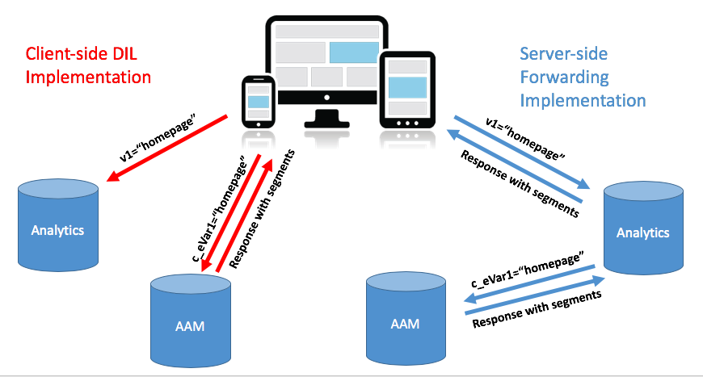
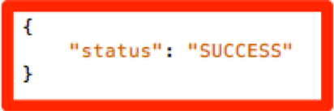

# De AAM van uw site migreren van [!DNL Client-Side] DIL naar [!DNL Server-Side Forwarding] {#migrating-your-site-s-aam-implementation-from-client-side-dil-to-server-side-forwarding}

Deze zelfstudie is op u van toepassing als u zowel Adobe Audience Manager (AAM) als Adobe Analytics hebt en u momenteel een hit van de pagina naar AAM verzendt met de code &quot;DIL&quot; ([!DNL Data Integration Library]) en ook een hit van de pagina naar Adobe Analytics verzendt. Aangezien u beide oplossingen hebt, en aangezien zij allebei deel van Adobe Experience Cloud uitmaken, hebt u de kans om de beste praktijk te volgen om &quot;[!DNL Server-Side Forwarding] (SSF) aan te zetten,&quot;die de servers van de [!DNL Analytics] gegevensinzameling toelaat om plaats analysegegevens in real time aan Audience Manager door te sturen, in plaats van het hebben van [!DNL client-side] code een extra klap van de pagina naar AAM verzendt. Dit leerprogramma zal u door de stappen lopen om de schakelaar van de oudere &quot;[!DNL Client-Side DIL]&quot;implementatie aan de nieuwere &quot;[!DNL Server-Side forwarding]&quot;methode te maken.

## [!DNL Client-Side] (DIL) vs. [!DNL Server-Side] {#client-side-dil-vs-server-side}

Bij het vergelijken en contrasteren van deze twee methoden om Adobe Analytics-gegevens in AAM te krijgen, kan het in de eerste plaats nuttig zijn om de verschillen in de volgende afbeelding te visualiseren:

### [!DNL Client-side] DIL-implementatie {#client-side-dil-implementation}

Als u deze methode gebruikt om Adobe Analytics-gegevens in AAM te krijgen, betekent dit dat er twee hits op je webpagina&#39;s komen: Eén gaat naar [!DNL Analytics]en één gaat naar AAM (na het kopiëren van de [!DNL Analytics] gegevens op de webpagina. [!UICONTROL Segments] worden teruggestuurd van AAM naar de pagina, waar ze kunnen worden gebruikt voor personalisatie, enz. Dit wordt beschouwd als een &#39;verouderde&#39; implementatie en wordt niet langer aanbevolen.

Afgezien van het feit dat dit niet de beste praktijken volgt, omvatten de nadelen om deze methode te gebruiken:

* Twee hits op de pagina in plaats van slechts één
* [!UICONTROL Server-Side Forwarding] is vereist voor het in real time delen van AAM publiek aan [!DNL Analytics], zodat [!DNL Client-side] implementaties deze functie (en mogelijk andere functies in de toekomst) niet toestaan

U wordt aangeraden over te schakelen op een [!UICONTROL Server-Side Forwarding] methode voor AAM implementatie.

### [!UICONTROL Server-Side Forwarding] Implementatie {#server-side-forwarding-implementation}

Zoals in bovenstaande afbeelding wordt getoond, komt een hit van de webpagina naar Adobe Analytics. [!DNL Analytics] stuurt die gegevens vervolgens door naar AAM in real time, en bezoekers worden beoordeeld naar AAM [!UICONTROL traits] en [!UICONTROL segments], net alsof de treffer rechtstreeks van de pagina afkomstig was.

[!UICONTROL Segments] worden teruggekeerd op de zelfde real time klap terug naar [!DNL Analytics], die de reactie op de Web-pagina voor verpersoonlijking, enz. door:sturen.

Er is geen timing aan het bewegen naar server-kant door:sturen. Wij adviseren hoogst dat iedereen die zowel Audience Manager heeft als deze implementatiemethode [!DNL Analytics] gebruikt.

## U hebt twee hoofdtaken {#you-have-two-main-tasks}

Er staat nogal wat informatie op deze pagina, en dat is natuurlijk allemaal belangrijk. Het gaat echter **allemaal om twee belangrijke dingen die u moet doen**:

1. De code wijzigen van [!DNL Client-Side] DIL-code in [!UICONTROL Server-Side Forwarding] code
1. Draai de schakelaar in het [!DNL Analytics] om het daadwerkelijke door:sturen van gegevens (per [!DNL Admin Console] [!UICONTROL report suite]) te beginnen

Als u één van beide overslaat, zal SSF niet correct werken. Er zijn stappen en aanvullende gegevens toegevoegd aan dit document, zodat u deze twee stappen correct kunt uitvoeren.

## Implementatieopties {#implementation-options}

Als u van [!DNL client-side] naar [!DNL server-side]gaat, wordt de code gewijzigd in de nieuwe [!UICONTROL Server-Side Forwarding] code. Dit gebeurt op basis van een van de volgende opties:

* Adobe Experience Platform Launch - Onze aanbevolen implementatieoptie voor webeigenschappen. U zult zien dat dit een heel gemakkelijke taak is, zoals u al het moeilijke werk voor u [!DNL Launch] heeft gedaan.
* Op de pagina - U kunt de nieuwe SWF-code ook rechtstreeks in de `doPlugins` functie in het [!DNL appMeasurement.js] bestand plaatsen als u (nog) geen Adobe Launch gebruikt
* Andere tagmanagers - Deze kunnen op dezelfde manier worden behandeld als de vorige optie (Op de pagina), aangezien u de SSF-code nog steeds in de code plaatst `doPlugins`, waar de andere tagmanager de [!DNL AppMeasurement] code opslaat

Hieronder vindt u een overzicht van deze opties in de sectie De code bijwerken.

## Implementatiestappen {#implementation-steps}

### Stap 0: Vereiste: Experience Cloud ID-service (ECID) {#step-prerequisite-experience-cloud-id-service-ecid}

De belangrijkste voorwaarde voor de overgang naar [!UICONTROL Server-Side Forwarding] is dat de Experience Cloud ID-service wordt geïmplementeerd. Dit is het gemakkelijkst gedaan als u Experience Platform Launch gebruikt, in welk geval u eenvoudig de uitbreiding ECID installeert en het de rest zal doen.

Als u een niet-Adobe TMS of helemaal geen TMS gebruikt, implementeert u ECID **vóór** andere Adobe-oplossingen. Raadpleeg de [ECID-documentatie](https://marketing.adobe.com/resources/help/en_US/mcvid/) voor meer informatie. De enige andere voorwaarde is betreffende codeversies, zodat aangezien u eenvoudig de meest recente versies van de code in de volgende stappen toepast, zult u in orde zijn.

>[!NOTE]
>
>Lees dit gehele document voordat u het implementeert. De sectie &quot;Timing&quot; hieronder bevat belangrijke informatie over *wanneer* u elk onderdeel moet implementeren, inclusief ECID (als dit nog niet is geïmplementeerd).

### Stap 1: Opties voor opnemen die momenteel worden gebruikt vanuit DIL-code {#step-record-currently-used-options-from-dil-code}

Terwijl u van [!DNL Client-Side] DIL code naar [!UICONTROL Server-Side Forwarding]gaat, moet u eerst alles identificeren wat u met DIL code doet, inclusief aangepaste instellingen en gegevens die naar AAM worden verzonden. U kunt onder andere de volgende dingen opmerken en overwegen:

* Normale [!DNL Analytics] variabelen, met de module [!DNL siteCatalyst.init] DIL - U hoeft zich geen zorgen te maken over deze variabele, omdat de normale [!DNL Analytics] variabelen alleen worden verzonden en dat gebeurt door SSF-functionaliteit gewoon in te schakelen.
* Subdomain van de partner - in de functie DIL.create, neem een nota van de `partner` parameter. Dit is gekend als uw &quot;partner subdomain,&quot;of soms &quot;partner identiteitskaart,&quot;en zal nodig zijn wanneer u de nieuwe code SSF plaatst.
* [!DNL Visitor Service Namespace] - Ook bekend als &quot;[!DNL Org ID]&quot; of &quot;[!DNL IMS Org ID]&quot;, hebt u dit ook nodig wanneer u de nieuwe SSF-code instelt. Noteer dit.
* containerNSID, uuidCookie, en andere geavanceerde opties - maak nota van om het even welke extra geavanceerde opties u gebruikt zodat u hen in de code kunt eveneens plaatsen SSF.
* Extra paginabariabelen - Als andere variabelen van de pagina naar AAM worden verzonden (naast de normale [!DNL Analytics] variabelen die door siteCatalyst.init worden behandeld), zult u nota van hen moeten maken zodat zij via SSF kunnen worden verzonden (spoiler waakzaam: via [!DNL contextData] variabelen).

### Stap 2: De code bijwerken {#step-updating-the-code}

In de sectie hierboven met de titel &quot;Implementatieopties&quot; worden meerdere opties gegeven met betrekking tot hoe/waar u implementeert [!UICONTROL Server-Side Forwarding]. Om deze paragraaf doeltreffend te maken, moeten we ze in deze secties opsplitsen (met twee gecombineerd). Ga naar de methode van deze sectie die uw behoeften het best beschrijft.

#### Adobe Experience Platform Launch {#launch-by-adobe}

Bekijk de onderstaande video voor meer informatie over het verplaatsen van implementatieopties van [!DNL Client-Side] DIL code naar [!UICONTROL Server-Side Forwarding] Experience Platform Launch.

>[!VIDEO](https://video.tv.adobe.com/v/26310/?quality=12)

#### &quot;Op de pagina&quot; of niet-Adobe Tag Manager {#on-the-page-or-non-adobe-tag-manager}

Bekijk de onderstaande video voor meer informatie over het verplaatsen van implementatieopties van [!DNL Client-Side] DIL code naar [!UICONTROL Server-Side Forwarding] in [!DNL AppMeasurement] code, die zich in een bestand of in een niet-Adobe-tagbeheersysteem bevindt.

>[!VIDEO](https://video.tv.adobe.com/v/26312/?quality=12)

### Stap 3: Het toelaten van het door:sturen (per [!UICONTROL Report Suite]) {#step-enabling-the-forwarding-per-report-suite}

Tot nu toe in deze zelfstudie hebben we al onze tijd doorgebracht om de code van [!DNL Client-Side DIL] code naar [!UICONTROL Server-Side Forwarding]te schakelen. Dat is prima, want het is het moeilijkste. Hoewel u zult zien dat deze sectie bijzonder eenvoudig is, is deze net zo belangrijk als het bijwerken van de code. In deze video, zult u zien hoe te om de schakelaar te draaien die het daadwerkelijke door:sturen van gegevens van Analytics aan Audience Manager toelaat.

>[!VIDEO](https://video.tv.adobe.com/v/26355/?quality-12)

**OPMERKING:** Zoals verklaard in de video, herinner dat het tot 4 uren voor het toelaten van het door:sturen zal duren om volledig op de Experience Cloud backend worden uitgevoerd.

## Timing {#timing}

Er zijn twee belangrijke taken om over te stappen van [!DNL Client-Side DIL] naar [!UICONTROL Server-Side Forwarding]:

1. De code bijwerken
1. De schakelaar in [!DNL Analytics] [!DNL Admin Console]

Maar de vraag is: welke doe je eerst? Maakt het uit? Dat waren twee vragen. Maar de antwoorden zijn... het hangt af, en ja, het *kan* ertoe doen. Hoe is dat voor vaag? Laten we het splitsen. Maar eerst een aanvullende vraag die kan ontstaan als je een grote organisatie bent met veel sites: Moet ik alles tegelijk doen? Dat is iets makkelijker. Nope. Je kunt het stuk voor stuk doen...soort van. :)

### Een beetje dieper duiken {#a-little-deeper-dive}

De reden waarom timing en orde materie wegens hoe door:sturen *werkelijk *works is, die in de volgende weinig technische feiten kan worden samengevat:

* Als u de Experience Cloud ID Service (ECID) hebt geïmplementeerd en de switch in de [!DNL Analytics] switch [!DNL Admin Console] (&quot;the switch&quot;) ingeschakeld is, zullen de gegevens van [!DNL Analytics] naar AAM worden doorgestuurd, zelfs als u de code nog niet hebt bijgewerkt.
* Als u ECID niet hebt uitgevoerd, zullen de gegevens niet door:sturen, zelfs als u de schakelaar hebt, en de code SSF hebben.
* De SSF-code (in [!DNL Launch] of op de pagina) handelt echt de reactie af en is natuurlijk nodig om de migratie te voltooien.
* Herinner dat de schakelaar SSF door wordt toegelaten, [!UICONTROL Report Suite]maar dat de code door bezit binnen [!DNL Launch], of door [!DNL AppMeasurement] dossier wordt behandeld als u niet gebruikt [!DNL Launch]

### Aanbevolen werkwijzen {#best-practices}

Op basis van deze technische details zijn hier de aanbevelingen voor de timing van &quot;wat te doen wanneer&quot;:

#### Als u ECID nog niet hebt geïmplementeerd {#if-you-do-not-have-ecid-yet-implemented}

1. Draai de schakelaar binnen [!DNL Analytics] voor elk [!UICONTROL report suite] dat u voor SSF zult toelaten

   1. Het doorsturen begint nog niet omdat u geen ECID hebt

1. Werk per site uw code bij van [!DNL Client-Side DIL] naar SSF (dit kan zich op [!DNL Launch] of op de pagina bevinden, zoals in een andere sectie hierboven wordt beschreven)

   1. Het door:sturen zal nu stromen (aangezien u ECID hebt toegevoegd), en u zou ook een juiste reactie JSON op uw [!DNL Analytics] baken moeten ontvangen (zie de sectie van de Bevestiging en van het Oplossen van problemen hieronder voor meer details)

#### Als u ECID hebt geïmplementeerd {#if-you-do-have-ecid-implemented}

1. Bereid en plan zodat u klaar bent om uw code van DIL aan SSF PER bij te werken [!UICONTROL report suite] die u voor SSF zult toelaten:

   1. Draai de schakelaar binnen [!DNL Analytics] om SSF toe te laten

      1. Het doorsturen begint omdat je ECID hebt ingeschakeld
   1. Werk uw code zo snel mogelijk bij van [!DNL Client-Side DIL] naar SSF (dit kan zich op [!DNL Launch] of op de pagina bevinden, zoals in een andere sectie hierboven wordt besproken)

      1. U zou een juiste reactie JSON op uw [!DNL Analytics] baken moeten ontvangen (zie de sectie van de Bevestiging en van het Oplossen van problemen hieronder voor meer details)

**OPMERKING 1:** Het is belangrijk om deze twee stappen zo dicht mogelijk bij elkaar te doen, omdat u tussen stap 1 en 2 hierboven dubbele gegevens hebt die naar AAM gaan. Met andere woorden, SSF zal beginnen gegevens van [!DNL Analytics] aan AAM te verzenden, en aangezien de code van de DIL nog op de pagina is, zal er ook een klap zijn die rechtstreeks van de pagina naar AAM gaat, waarbij de gegevens worden verdubbeld. Zodra u de code van DIL aan SSF bijwerkt, zal dit worden verlicht.

**OPMERKING 2:** Als u liever een kleine discrepantie in gegevens hebt in plaats van een kleine duplicatie van gegevens, kunt u de volgorde van stap 1 en 2 hierboven wijzigen. Als u de code van DIL naar SSF verplaatst, stopt de gegevensstroom in AAM totdat u de schakelaar kunt omdraaien om de SSF voor de [!UICONTROL report suite]SWF in te schakelen. Meestal zouden klanten liever een kleine verdubbeling van gegevens hebben in plaats van bezoekers binnen te laten [!UICONTROL traits] en [!UICONTROL segments].

#### Timing van migratie wanneer u veel sites en [!UICONTROL Report Suites] {#migration-timing-when-you-have-many-sites-and-report-suites}

Dit onderwerp wordt in eerdere paragrafen kort besproken, in die zin dat de hoofdstrategie als volgt kan worden samengevat:

Eén site/[!UICONTROL report suite] (of groep sites/[!UICONTROL report suites]) tegelijk migreren.

Nochtans, kan dit een beetje lastig worden gebaseerd op een paar mogelijke scenario&#39;s:

* U hebt een site die verschillende specifieke [!UICONTROL report suites]
* U hebt een [!UICONTROL report suite] map met meerdere sites (zoals een algemene site [!UICONTROL report suite])
* U gebruikt één [!DNL Launch] eigenschap om meerdere sites te bestrijken
* U hebt verschillende ontwikkelingsteams voor verschillende sites

Vanwege deze items kan het een beetje ingewikkeld worden. De beste dingen die ik kan voorstellen zijn:

* Neem wat tijd om een strategie voor de migratie naar SSF te maken, gebaseerd op de hierboven uiteengezette zaken
* Gebaseerd op het feit dat één enkel bezit in [!DNL Launch] (of één enkel [!DNL AppMeasurement] dossier) typisch aan 1 of 2 verschillend toewijst [!UICONTROL report suites], zult u waarschijnlijk een plan kunnen maken dat aan deze verschillende groepen één voor één werkt, die uw onderneming aan SSF bijwerken
* Als u met Adobe Consulting werkt, praat dan met hen over uw migratieplan, zodat zij waar nodig hulp kunnen bieden

## Validatie en probleemoplossing {#validation-and-troubleshooting}

De belangrijkste manier om te controleren of de app [!UICONTROL Server-Side Forwarding] actief is, is door te kijken naar de reactie op al uw Adobe Analytics-hits van de app.

Als u geen gegevens [!UICONTROL server-side forwarding] van [!DNL Analytics] aan Audience Manager doet, dan is er echt geen reactie op het [!DNL Analytics] baken (behalve een pixel 2x2). Nochtans, als u SSF doet, dan zijn er punten die u in het [!DNL Analytics] [!DNL Analytics] verzoek en de reactie kunt verifiëren die u zullen laten weten dat correct met Audience Manager communiceert, door:sturen de klap, en het krijgen van een reactie.

>[!VIDEO](https://video.tv.adobe.com/v/26359/?quality=12)

**WAARSCHUWING:** Let op de fout &quot;Succes&quot; - Als er een reactie is, en alles lijkt te werken, zorg ervoor dat u het &quot;dingen&quot;voorwerp in de reactie hebt. Als je dat niet doet, zie je misschien een bericht dat zegt [!DNL "status":"SUCCESS"]. Hoe gek dit ook klinkt, dit is eigenlijk een bewijs dat het NIET correct werkt. Als u dit ziet, betekent het dat u de cosupdate binnen [!DNL Launch] of [!DNL AppMeasurement], maar hebt voltooid dat het door:sturen in [!DNL Analytics] nog niet [!DNL Admin Console] heeft voltooid. In dit geval moet u verifiëren dat u SSF in de [!DNL Analytics] voor [!DNL Admin Console] uw [!UICONTROL report suite]. Als je wel, en dat is nog geen 4 uur, geduld hebt, omdat het zo lang kan duren om alle noodzakelijke veranderingen op de achtergrond te maken.

Raadpleeg de [!UICONTROL Server-Side Forwarding]documentatie [voor meer informatie over](https://marketing.adobe.com/resources/help/en_US/reference/ssf.html)de site.
