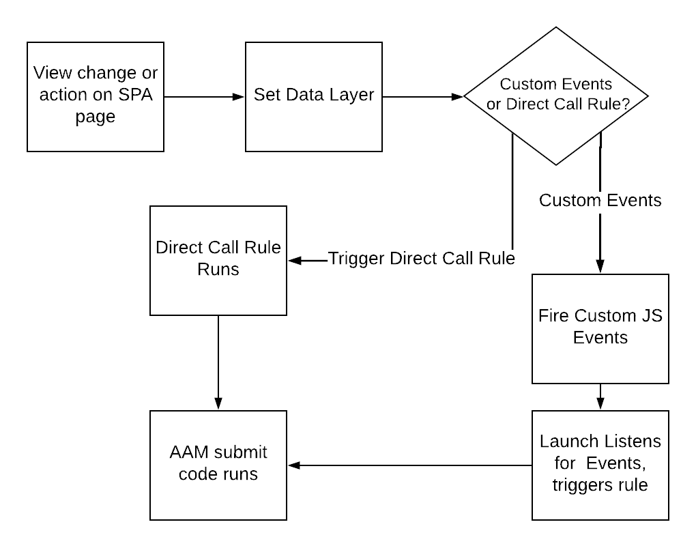

# Gebruik de beste werkwijzen op SPA pagina&#39;s wanneer u gegevens naar AAM verzendt {#using-best-practices-on-spa-pages-when-sending-data-to-aam}

In dit document worden verschillende aanbevolen procedures beschreven voor het verzenden van gegevens van toepassingen (SPA) naar Adobe Audience Manager (AAM). In dit artikel wordt het gebruik van [!UICONTROL Experience Platform tags], de aanbevolen uitvoeringsmethode.

## Eerste aantekeningen

* Bij de onderstaande items wordt ervan uitgegaan dat u Platform-tags gebruikt om te implementeren op uw site. De overwegingen bestaan nog als u geen markeringen van het Platform gebruikt, maar u zou hen aan uw implementatiemethode moeten aanpassen.
* Alle SPA zijn verschillend, zodat zou u sommige van de volgende punten kunnen moeten aanpassen om aan uw vereisten het best te voldoen, maar Adobe wil sommige beste praktijken delen die u over moet denken aangezien u gegevens van SPA pagina&#39;s naar Audience Manager verzendt.

## Eenvoudig diagram van het werken met SPA en AAM in Experience Platforms markeringen (vroeger, Lancering){#simple-diagram-of-working-with-spas-and-aam-in-experience-platform-launch}

>[!NOTE]
>Zoals vermeld, is dit een vereenvoudigd diagram van hoe SPA pagina&#39;s in een implementatie van Adobe Audience Manager (zonder Adobe Analytics) gebruikend Platform markeringen worden behandeld. Zoals u kunt zien, is het vrij recht-voorwaarts, met het grote besluit is hoe u een meningsverandering (of een actie) aan de markeringen van het Platform gaat meedelen.

## Labels uit de SPA pagina bijsnijden {#triggering-launch-from-the-spa-page}

Twee van de gemeenschappelijkere methodes om een regel in de markeringen van het Platform (en daarom het verzenden van gegevens naar Audience Manager) teweeg te brengen, zijn:

* Aangepaste JavaScript-gebeurtenissen instellen (zie voorbeeld [HIER](https://helpx.adobe.com/analytics/kt/using/spa-analytics-best-practices-feature-video-use.html) met Adobe Analytics)
* Een [!UICONTROL Direct Call Rule]

In dit voorbeeld gebruikt u een [!UICONTROL Direct Call rule] in Platform-tags om te zorgen dat de treffer de Audience Manager in gaat. Zoals u in de volgende secties zult zien, wordt dit handig wanneer u de opdracht [!UICONTROL Data Layer] een nieuwe waarde, zodat deze door de [!UICONTROL Data Element] in Platform-tags.

## Demopagina {#demo-page}

Dit is een kleine pagina die het veranderen van een waarde in de gegevenslaag en het verzenden van het in Audience Manager aantoont, zoals u op een SPA pagina kunt doen. Deze functionaliteit kan worden gemodelleerd voor uitgebreidere wijzigingen die nodig zijn. U kunt deze demopagina vinden [HIER](https://aam.enablementadobe.com/SPA-Launch.html).

## De gegevenslaag instellen {#setting-the-data-layer}

Zoals vermeld, wanneer nieuwe inhoud op de pagina wordt geladen of wanneer iemand een actie op de plaats uitvoert, moet de gegevenslaag dynamisch in de kop van de pagina worden geplaatst VOORDAT de markeringen van het Platform worden geroepen en in werking gesteld [!UICONTROL rules], zodat Platforms tags de nieuwe waarden uit de gegevenslaag kunnen ophalen en in de Audience Manager kunnen duwen.

Als u naar de hierboven vermelde demosite gaat en naar de paginabron kijkt, ziet u:

* De gegevenslaag bevindt zich in de kop van de pagina, vóór het aanroepen van Platform-tags
* Het JavaScript in de gesimuleerde SPA-koppeling wijzigt de [!UICONTROL Data Layer], roept vervolgens Platform-tags aan (de `_satellite.track()` vraag). Als u in plaats van deze aangepaste JavaScript-gebeurtenissen gebruikte [!UICONTROL Direct Call Rule]Maar de les is hetzelfde. Wijzig eerst de [!DNL data layer]en roep vervolgens Platform-tags aan.

>[!VIDEO](https://video.tv.adobe.com/v/23322/?quality=12)

## Aanvullende bronnen {#additional-resources}

* [SPA discussie over de forums van de Adobe](https://forums.adobe.com/thread/2451022)
* [Referentie Architectuur plaatsen om te tonen hoe te om SPA in Platform markeringen uit te voeren](https://helpx.adobe.com/experience-manager/kt/integration/using/launch-reference-architecture-SPA-tutorial-implement.html)
* [Best practices gebruiken bij het bijhouden van SPA in Adobe Analytics](https://helpx.adobe.com/analytics/kt/using/spa-analytics-best-practices-feature-video-use.html)
* [Demopsite gebruikt voor dit artikel](https://aam.enablementadobe.com/SPA-Launch.html)
